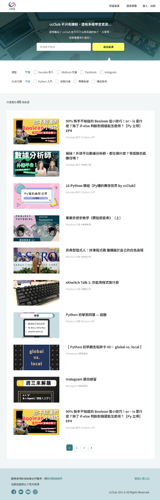
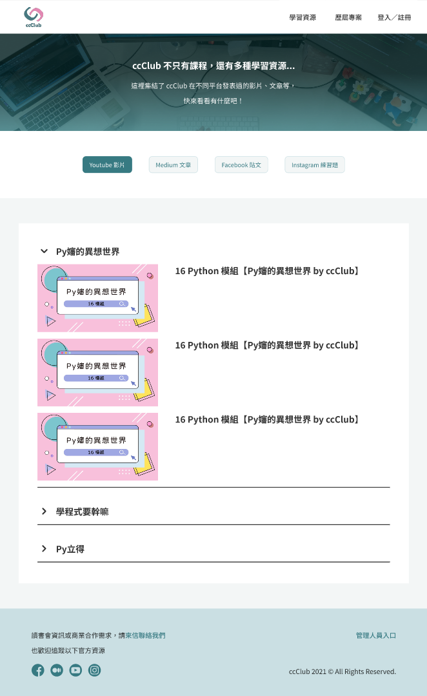

## Goal

Improve ccClub.io's user growth and retention.

## Solution

- **Redesigned home page:** Added a carousel, corresponding sections to match each carousel slide, and a featured video/article section.
- **Created a new learning resources page:** Consolidated past videos and articles ccClub had posted across other platforms, boosting the site's SEO.

[View Figma prototype](https://www.figma.com/proto/1j1EQP6deU258kRdtIn0Bj/ccClub-Homepage-Redesign--for-portfolio-?node-id=0-1&t=9pwIKGrEUMLMVPb2-1)

## Challenges

The initial design of the learning resources page included a search bar, but the search function had to be removed due to YouTube and Medium API quota limits.

**Original design:**

**Final design:**

## Results

The live page is at [ccclub.io/resources/learning](https://www.ccclub.io/resources/learning).

### Metadata

- Duration: April 2024
- Responsibilities: Web Design