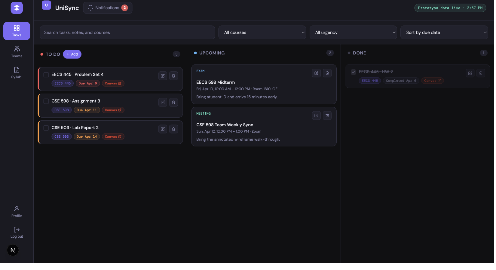
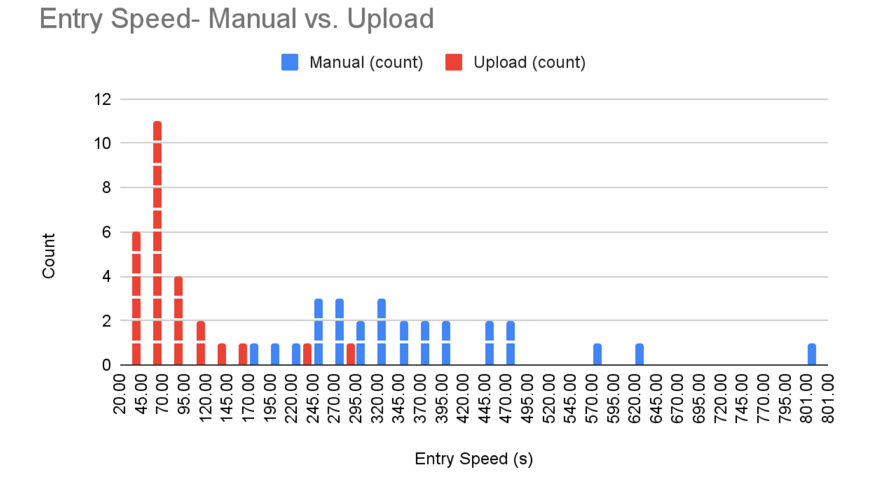
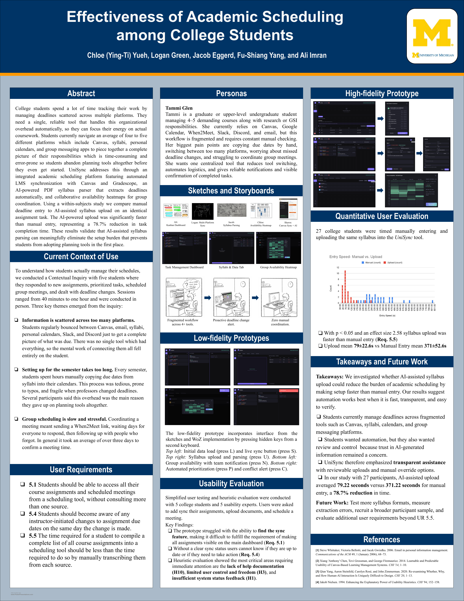

## Abstract

College students spend a lot of time tracking their work by managing deadlines scattered across multiple platforms. They need a single, reliable tool that handles this organizational overhead automatically, so they can focus their energy on actual coursework. Students currently navigate an average of four to five different platforms which include Canvas, syllabi, personal calendars, and group messaging apps to piece together a complete picture of their responsibilities. This fragmentation creates a planning tax where manually transferring deadlines at the start of each semester is so time-consuming and error-prone that students abandon planning tools altogether before they even get started. UniSync addresses this through an integrated academic scheduling platform featuring automated LMS synchronization with Canvas and Gradescope, an AI-powered PDF syllabus parser that extracts deadlines automatically, and collaborative availability heatmaps for group coordination. To evaluate the core efficiency claim, we conducted a within-subjects study with 27 participants comparing manual deadline entry to AI-assisted syllabus upload on an identical assignment task. The AI-powered upload was significantly faster than manual entry, representing a 78.7% reduction in task completion time. These results validate that AI-assisted syllabus parsing can meaningfully eliminate the setup burden that prevents students from adopting planning tools in the first place.

## Method

This was a course project structured around a sequence of HCI research methods, including contextual inquiry, heuristic evaluation, and usability testing. We used contextual inquiry (survey and contextual interview) to define the problem and design our first prototype and heuristic evaluation and usuability testing to iterate our design. UniSync is the prototype we built to apply them.

- **Research:** Formative survey (n=38) plus contextual inquiry with 5 students, consolidated into sequence models, flow diagrams, and an affinity wall to surface seven user requirements.
- **Design:** Individual sketches and storyboards from all five team members (including the group-availability heatmap concept) were critiqued and merged into one persona-driven low-fidelity prototype.
- **Evaluation:** Heuristic evaluation and simplified user testing on the low-fi prototype exposed usability failures around system status and AI transparency, pushing the design from "invisible automation" to **transparent assistance** — a three-tier import flow (API sync, syllabus upload with review, manual entry) — in the high-fidelity build.

## Study & Findings

To test the core efficiency claim (Requirement 5.5 — automated compilation must be faster than manual transcription), we ran a within-subjects study with **27 participants**, each compiling the same syllabus's assignments both by hand and via UniSync's AI-powered upload.

- AI-assisted upload averaged **79s** vs. **371s** for manual entry — a **78.7% reduction** in task completion time (paired t-test, p = 3.33e-13, Cohen's d = 2.58).
- The effect held even with verification time included, validating that transparent, reviewable AI assistance can preserve efficiency gains without sacrificing user control.
- Limitations: tested against a single syllabus format, and error rates between AI extraction and manual entry were out of scope for this study.

## Presentation

## Metadata

- Duration: Winter 2026 semester
- Team: 5 people (Chloe Yueh, Logan Green, Jacob Eggerd, Fu-Shiang Yang, Ali Imran)
- Responsibilities: Contextual inquiry and affinity diagramming, design and prototyping (group-availability heatmap concept), and co-writing the paper
- [Full paper (PDF)](unisync-paper.pdf)
- [Poster (PDF)](unisync-poster.pdf)
